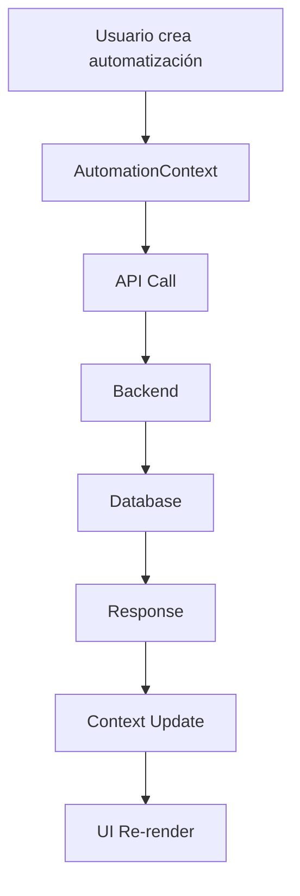
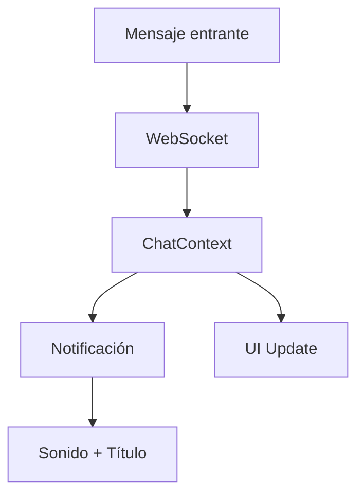

# Gestión de Estado en FUSIONCOL Frontend

## 📋 Descripción

El frontend de FUSIONCOL utiliza una combinación de Context API de React y hooks personalizados para manejar el estado de la aplicación de manera eficiente y escalable.

## 🏗️ Arquitectura de Estado

### Contextos Principales

#### 1. **AutomationContext**

- **Propósito**: Gestión completa de automatizaciones y workflows
- **Ubicación**: `src/contexts/AutomationContext.tsx`
- **Documentación**: [AutomationContext README](../src/contexts/README.md)

**Características**:

- Estado centralizado con `useReducer`
- Operaciones CRUD para automatizaciones
- Historial de cambios (undo/redo)
- Gestión de nodos y conexiones ReactFlow

#### 2. **ChatContext**

- **Propósito**: Gestión de conversaciones y mensajes
- **Ubicación**: `src/contexts/ChatContext.tsx`

**Características**:

- WebSocket integration
- Gestión de conversaciones activas
- Notificaciones en tiempo real
- Estado de typing indicators

#### 3. **AuthContext**

- **Propósito**: Autenticación y autorización
- **Ubicación**: `src/contexts/AuthContext.tsx`

**Características**:

- JWT token management
- User session handling
- Role-based permissions
- Auto-refresh de tokens

## 🔄 Patrones de Estado

### 1. **Reducer Pattern (AutomationContext)**

```typescript
interface AutomationState {
  currentWorkflow: Workflow;
  automations: Automation[];
  loading: LoadingStates;
  editor: EditorState;
  error: string | null;
}

type AutomationAction =
  | { type: "LOAD_AUTOMATIONS_START" }
  | { type: "LOAD_AUTOMATIONS_SUCCESS"; payload: Automation[] }
  | { type: "LOAD_AUTOMATIONS_ERROR"; payload: string }
  | { type: "ADD_NODE"; payload: Node }
  | { type: "DELETE_NODE"; payload: string };
// ... más acciones

const automationReducer = (
  state: AutomationState,
  action: AutomationAction
): AutomationState => {
  switch (action.type) {
    case "LOAD_AUTOMATIONS_SUCCESS":
      return {
        ...state,
        automations: action.payload,
        loading: { ...state.loading, workflows: false },
      };
    // ... más casos
  }
};
```

### 2. **Estado Local con useState**

Para componentes específicos que no necesitan estado global:

```typescript
const [isOpen, setIsOpen] = useState(false);
const [formData, setFormData] = useState(initialData);
const [errors, setErrors] = useState<ValidationErrors>({});
```

### 3. **Estado Derivado con useMemo**

Para cálculos costosos basados en el estado:

```typescript
const filteredAutomations = useMemo(() => {
  return automations.filter((automation) =>
    automation.name.toLowerCase().includes(searchTerm.toLowerCase())
  );
}, [automations, searchTerm]);
```

## 🎯 Hooks Personalizados

### 1. **usePageTitle**

- **Propósito**: Gestión de notificaciones en el título
- **Ubicación**: `src/hooks/usePageTitle.ts`

```typescript
const { showNewMessageNotification, restoreTitle } = usePageTitle({
  defaultTitle: "FusionCRM",
  blinkInterval: 2000,
  blinkDuration: 15000,
});
```

### 2. **useNotificationSound**

- **Propósito**: Reproducción de sonidos de notificación
- **Ubicación**: `src/hooks/useNotificationSound.ts`

```typescript
const { playNotificationSound, testSound } = useNotificationSound({
  soundUrl: "/sounds/notification.mp3",
  volume: 0.6,
  enabled: true,
});
```

### 3. **useWebSocket**

- **Propósito**: Conexión y manejo de WebSockets
- **Ubicación**: `src/hooks/useWebSocket.ts`

```typescript
const { socket, isConnected, emit } = useWebSocket({
  url: process.env.VITE_SOCKET_URL,
  autoConnect: true,
});
```

## 📊 Flujo de Datos

### Flujo de Automatizaciones



### Flujo de Chat



## 🔧 Optimizaciones de Rendimiento

### 1. **Memoización de Componentes**

```typescript
const ExpensiveComponent = React.memo(({ data }) => {
  return <div>{/* Renderizado costoso */}</div>;
});
```

### 2. **Callbacks Memoizados**

```typescript
const handleNodeClick = useCallback(
  (nodeId: string) => {
    setSelectedNode(nodeId);
  },
  [setSelectedNode]
);
```

### 3. **Lazy Loading de Contextos**

```typescript
const AutomationProvider = lazy(() => import("./AutomationContext"));
```

### 4. **Debouncing en Búsquedas**

```typescript
const debouncedSearch = useMemo(
  () =>
    debounce((term: string) => {
      // Lógica de búsqueda
    }, 300),
  []
);
```

## 🎨 Patrones de Actualización

### 1. **Optimistic Updates**

```typescript
const deleteAutomation = async (id: string) => {
  // Actualización optimista
  dispatch({ type: "DELETE_AUTOMATION_OPTIMISTIC", payload: id });

  try {
    await api.deleteAutomation(id);
    // Confirmación exitosa
    dispatch({ type: "DELETE_AUTOMATION_SUCCESS", payload: id });
  } catch (error) {
    // Revertir en caso de error
    dispatch({ type: "DELETE_AUTOMATION_ERROR", payload: { id, error } });
  }
};
```

### 2. **Batch Updates**

```typescript
const updateMultipleNodes = (updates: NodeUpdate[]) => {
  dispatch({ type: "BATCH_UPDATE_NODES", payload: updates });
};
```

### 3. **Conditional Updates**

```typescript
useEffect(() => {
  if (shouldUpdate && !loading) {
    loadAutomations();
  }
}, [shouldUpdate, loading, loadAutomations]);
```

## 🔍 Debugging del Estado

### 1. **Redux DevTools (para Reducers)**

```typescript
const AutomationProvider = ({ children }) => {
  const [state, dispatch] = useReducer(
    automationReducer,
    initialState,
    // Habilitar DevTools en desarrollo
    process.env.NODE_ENV === "development"
      ? window.__REDUX_DEVTOOLS_EXTENSION__?.()
      : undefined
  );
};
```

### 2. **React Developer Tools**

Usar la extensión de React DevTools para inspeccionar contextos y estado.

### 3. **Custom Logging**

```typescript
const useStateLogger = (stateName: string, state: any) => {
  useEffect(() => {
    if (process.env.NODE_ENV === "development") {
      console.log(`${stateName} updated:`, state);
    }
  }, [stateName, state]);
};
```

## 📋 Mejores Prácticas

### 1. **Separación de Responsabilidades**

- Un contexto por dominio de negocio
- Hooks específicos para lógica reutilizable
- Estado local para UI específica

### 2. **Inmutabilidad**

```typescript
// ✅ Correcto
const newState = {
  ...state,
  items: [...state.items, newItem],
};

// ❌ Incorrecto
state.items.push(newItem);
```

### 3. **Tipado Estricto**

```typescript
interface AutomationState {
  readonly currentWorkflow: Workflow | null;
  readonly automations: readonly Automation[];
  readonly loading: Readonly<LoadingStates>;
}
```

### 4. **Error Boundaries**

```typescript
const ErrorBoundary = ({ children }) => {
  // Manejo de errores en contextos
};
```

## 🧪 Testing del Estado

### 1. **Testing de Reducers**

```typescript
describe("automationReducer", () => {
  it("should add node correctly", () => {
    const action = { type: "ADD_NODE", payload: mockNode };
    const newState = automationReducer(initialState, action);

    expect(newState.currentWorkflow.nodes).toContain(mockNode);
  });
});
```

### 2. **Testing de Contextos**

```typescript
const renderWithContext = (component) => {
  return render(<AutomationProvider>{component}</AutomationProvider>);
};
```

### 3. **Mocking de Hooks**

```typescript
jest.mock("../hooks/useWebSocket", () => ({
  useWebSocket: () => ({
    socket: mockSocket,
    isConnected: true,
    emit: jest.fn(),
  }),
}));
```

## 📈 Métricas y Monitoreo

### 1. **Performance Monitoring**

```typescript
const usePerformanceMonitor = (componentName: string) => {
  useEffect(() => {
    const start = performance.now();
    return () => {
      const end = performance.now();
      console.log(`${componentName} render time: ${end - start}ms`);
    };
  });
};
```

### 2. **Estado de Conexión**

```typescript
const useConnectionStatus = () => {
  const [isOnline, setIsOnline] = useState(navigator.onLine);

  useEffect(() => {
    const handleOnline = () => setIsOnline(true);
    const handleOffline = () => setIsOnline(false);

    window.addEventListener("online", handleOnline);
    window.addEventListener("offline", handleOffline);

    return () => {
      window.removeEventListener("online", handleOnline);
      window.removeEventListener("offline", handleOffline);
    };
  }, []);

  return isOnline;
};
```

---

Esta documentación proporciona una guía completa para entender y trabajar con la gestión de estado en FUSIONCOL Frontend.
